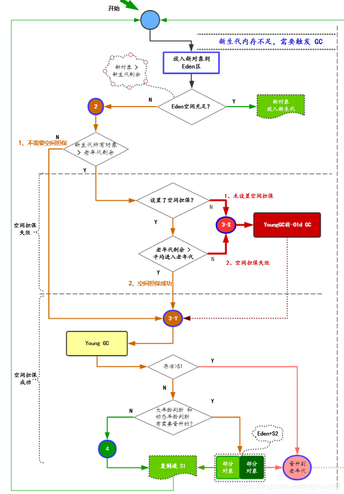

## javaSE 
### 01 base语法
### 02 面向对象oop
##### 20 Java虚拟机
###### 20.1 jvm内存模型
    运行时数据区
        Person person = new Person();
        方法区：线程共享的内存区域，为了区分堆，又被称为非堆
            Person的.class文件，常量，静态变量
        堆：线程共享的最大的一块内存区域
            new Person()对象
            所有对象实例及数组都要在堆上分配内存，同时它也是GC所管理的主要区域，因此常被称为GC堆。
            新生代（Young Generation）
            老年代（Old Generation）
        虚拟机栈
            person对象的引用，基本数据类型
        本地方法栈
            本地方法栈与 Java 虚拟机栈类似，它们之间的区别只不过是本地方法栈为本地方法服务
            本地方法一般是用其它语言（C、C++ 或汇编语言等）编写的，并且被编译为基于本机硬件和操作系统的程序，对待这些方法需要特别处理。
        程序计数器
            记录正在执行的虚拟机字节码指令的地址（如果正在执行的是本地方法则为空）
    执行引擎
    本地库接口
###### 20.2 Young GC和Full GC

    内存分配与回收策略
    young GC 和 Full GC 的含义及区别？
    young GC（新生代GC）：指发生在新生代的垃圾收集动作，新生代中的对象朝生夕死，所以 Minor GC 非常频繁，回收速度也比较快。
    Full GC（老年代GC）：指发生在老年代的GC，速度一般比 Minor GC 慢十倍以上。Full GC 会 Stop-The-World。
    什么时候触发young gc？
    对象优先在新生代 Eden 区中分配，如果 Eden 区没有足够的空间时，就会触发一次 Young GC 。
    什么时候会触发Full GC？
    如上图

    Young GC的触发时机
    Young GC其实一般就是在新生代的Eden区域满了之后就会触发，采用复制算法来回收新生代的垃圾
    Old GC和Full GC的触发时机
    下面几种情况：
    （1）发生Young GC之前进行检查，如果“老年代可用的连续内存空间” < “新生代历次Young GC后升入老年代的对象总和的平均大小”，说明本次Young GC后可能升入老年代的对象大小，可能超过了老年代当前可用内存空间。
    此时必须先触发一次Old GC给老年代腾出更多的空间，然后再执行Young GC。
    （2）执行Young GC之后有一批对象需要放入老年代，此时老年代就是没有足够的内存空间存放这些对象了，此时必须立即触发一次Old GC
    （3）老年代内存使用率超过了92%，也要直接触发Old GC，当然这个比例是可以通过参数调整的其实说白了，上述三个条件你概括成一句话，就是老年代空间也不够了，没法放入更多对象了，这个时候务必执行Old GC对老年代进行垃圾回收。
    顺便说一句，大家在很多地方看到一个说法，意思是说Old GC执行的时候一般都会带上一次Young GC
    可能很多人不理解，其实如果你把咱们这里的几个条件分析清楚了就知道了，一般Old GC很可能就是在Young GC之前触发或者在Young GC之后触发的，所以自然Old GC一般都会跟一次Young GC连带关联在一起了。
    另外一个，在很多JVM的实现机制里，其实在上述几种条件达到的时候，他触发的实际上就是Full GC，这个Full GC会包含Young GC、Old GC和永久代的GC。
    也就是说触发Full GC的时候，可能就会去回收年轻代、老年代和永久代三个区域的垃圾对象。
    但是这个东西其实没办法给大家一个准确的定义，说到底触发Full GC的时候，是先执行Young GC？还是先执行Old GC。
    因为不同的Full GC触发条件其实是不一样的，而且不同的JVM版本的实现机制也不同。
    所以很多时候，我们也只能给大家笼统的概括一句：上述条件满足时触发Full GC，Full GC一般会带上一次Young GC去回收新生代，同时也会有Old GC也回收老年代，还会去回收永久代。
    永久代满了之后怎么办？
    大家现在既然都知道了，Full GC有上述几个触发条件，同时触发Full GC的时候其实会带上针对新生代的Young GC，也会有针对老年代的Full GC，还会有针对永久代的GC。
    所以假如存放类信息、常量池的永久代满了之后，就会触发一次Full GC。这样Full GC执行的时候，就会顺带把永久代中的垃圾给回收了，但是永久代中的垃圾一般是很少的，因为里面存放的都是一些类，还有常量池之类的东西，这些东西通常来说是不需要回收的。
    如果永久代真的放满了，回收之后发现没腾出来更多的地方，此时只能抛出内存不够的异常了。
### 03 异常机制
### 04 Java常用类
### 05 数据结构算法
### 06 集合（容器）
### 07 IO流
### 08 多线程
### 09 网络编程
### 10 设计模式
##### 设计模式目的：提高代码的可重用性、可读性、可扩展性和可靠性，使程序呈现高内聚，低耦合的特性
#### 10.1. 设计模式七大原则：迪里接合依单开
##### 10.1.1 迪米特法原则
    是指一个对象应该对其他对象保持最少的了解，如果两个类不必直接通信，那么这两个类不应当发生直接的相互作用。如果其中一个类需要调用另一个类的某一个方法的话，可通过第三者发起这个调用
##### 10.1.2 里氏替换原则
    是指一个软件实体如果适用一个父类的话，那一定是适用于其子类，所有引用父类的地方必须能透明地使用其子类的对象，子类对象能够替换父类对象，而程序逻辑不变
##### 10.1.3 接口隔离原则
    是指用多个专门的接口，而不使用单一的总接口，客户端不应该依赖它不需要的接口
##### 10.1.4 合成复用原则
    是指尽量使用对象组合(has-a)或聚合(contanis-a)，而不是继承关系达到软件复用的目的
##### 10.1.5 依赖倒置原则
    是指设计代码结构时，高层模块不应该依赖底层模块，二者都应该依赖其抽象而不依赖于具体；抽象不应该依赖细节，细节依赖抽象
##### 10.1.6 单一职责原则
    是指一个Class/Interface/Method 只负责一项职责
##### 10.1.7 开闭原则
    是指一个软件实体如类、模块和函数应该对扩展开放， 对修改关闭
#### 10.2 23种设计模式
    创建型模式(5种)：用于描述“怎样创建对象”，它的主要特点是“将对象的创建与使用分离” 
    eg: 工厂方法模式、抽象工厂模式、单例模式、建造者模式、原型模式。

    结构型模式(7种)：用于描述如何将类或对象按某种布局组成更多的结构
    eg: 适配器模式、装饰器模式、代理模式、外观模式、桥接模式、组合模式、享元模式。

    行为型模式(11种)：用于描述类或对象之间怎样相互协作共同完成单个对象都无法单独完成的任务，以及怎样分配职责
    eg: 策略模式、模板方法模式、观察者模式、迭代子模式、责任链模式、命令模式、备忘录模式、状态模式、访问者模式、中介者模式、解释器模式。
##### 10.2.1 单例模式
    为什么要用单例模式，什么是单例模式
    优点
    0.避免创建多个实例造成资源的浪费，且多个实例由于多次调用容易导致结果出现错误，而使用单例模式能够使用保证整个应用中有且仅有一个实列。
    1.某些类创建频繁，对于一些大型的对象，这是一笔很大的系统开销
    2.省去了new操作符，降低了系统内存的使用频率，减轻GC压力
    3.有些类如交易所的核心交易引擎，控制着交易流程，如果该类可以创建多个的话，系统完全乱了。用单例模式的话，可以保证核心交易服务器独立控制整个流程。
    4.常用的工具类、线程池、缓存，数据库，账户登录系统、配置文件等程序中可能只允许我们创建一个对象
    缺点
    1.没有抽象层，不能扩展
    2.职责过重，违背单一性原则

    分类：单例模式的写法大的方面可以分为5种五种①懒汉式②饿汉式③双重校验锁④静态内部类⑤枚举
    饿汉式：类加载就会导致该单实例对象被创建
    优点：从它的实现中我们可以看到，这种方式的实现比较简单，在类加载的时候就完成了实例化，避免了线程的同步问题。
    缺点：由于在类加载的时候就实例化了，所以没有达到Lazy Loading(懒加载)的效果，也就是说可能我没有用到这个实例，但是它也会加载，会造成内存的浪费(但是这个浪费可以忽略，所以这种方式也是推荐使用的)。

    懒汉式：类加载不会导致该单实例对象被创建，而是首次使用该对象时才会创建
    导致有些问题：有多个线程去调用getInstance方法来获取Singleton的实例，那么就有可能发生这样一种情况当第一个线程在执行if(instance==null)这个语句时，此时instance是为null的进入语句。
    在还没有执行instance=new Singleton()时(此时instance是为null的)第二个线程也进入if(instance==null)这个语句，因为之前进入这个语句的线程中还没有执行instance=new Singleton()，
    所以它会执行instance=new Singleton()来实例化Singleton对象，因为第二个线程也进入了if语句所以它也会实例化Singleton对象。这样就导致了实例化了两个Singleton对象。所以单例模式的懒汉式是存在线程安全问题的

    Double-Check概念对于多线程开发者来说不会陌生，如代码中所示，我们进行了两次if (instance== null)检查，这样就可以保    证线程安全了。这样，实例化代码只用执行一次，后面再次访问时，判断if (instance== null)，直接return实例化对象。
    优点：线程安全；延迟加载；效率较高

    设计：
    不允许其他应用程序new对象： 因为new就是开辟新的空间，在这里更改数据只是更改的所创建的对象的数据，如果可以new的话，每一次new都产生一个对象，这样肯定保证不了对象的唯一性。
    在该类中创建对象：因为不允许其他程序new对象，所以这里的对象需要在本类中new出来
    对外提供一个可以让洽谈曾向获取该对象的方法：因为对象是在本类中创建的，所以需要提供一个方法让其它的类获取这个对象。
    (1)私有化该类的构造函数
    (2)通过new在本类中创建一个本类对象
    (3)定义一个公有的方法，将在该类中所创建的对象返回

    应用
    工具类、线程池、缓存，数据库，账户登录系统、配置文件

    面试
    其实单例设计模式在面试中很少有人会问饿汉式写法，一般都会问单例设计模式的懒汉式的线程安全问题，所以大家一定要充分理解单例模式的线程安全的问题

    链接 https://blog.csdn.net/dmk877/article/details/50311791

##### 10.2.1 工厂模式
    1.为什么要用工厂模式，什么是工厂模式
    在创建对象时不会对客户端暴露创建逻辑，并且是通过使用一个共同的接口来指向新创建的对象；用工厂方法代替new操作的一种模式
    使用new创建对象，是主动获取资源的方式，应用与资源之间是直接依赖的。
    而采用工厂模式获取对象时，是应用向工厂要对象，工厂从容器中获取对象返回给应用，是被动的，从而降低了应用和资源之间的依赖关系
    使用new创建对象是主动创建；把创建对象的主动权交给工厂，是被动创建，这种主动权的变化就叫控制反转
    将对象的创建和实现类选择进行统一管理和控制，从而将调用者跟我们的实现类解耦

    2.优点缺点
    3.分类
    3.1简单工厂模式
    工厂（factory）处理创建对象的细节，一旦有了SimpleCoffeeFactory，CoffeeStore类中的orderCoffee()就变成此对象的客户，
    后期如果需要Coffee对象直接从工厂中获取即可。这样也就解除了和Coffee实现类的耦合，同时又产生了新的耦合，CoffeeStore对象和SimpleCoffeeFactory工厂对象的耦合，工厂对象和商品对象的耦合。
    后期如果再加新品种的咖啡，我们势必要需求修改SimpleCoffeeFactory的代码，违反了开闭原则。工厂类的客户端可能有很多，比如创建美团外卖等，这样只需要修改工厂类的代码，省去其他的修改操作
    优点：
    封装了创建对象的过程，可以通过参数直接获取对象。把对象的创建和业务逻辑层分开，这样以后就避免了修改客户代码，如果要实现新产品直接修改工厂类，
    而不需要在原代码中修改，这样就降低了客户代码修改的可能性，更加容易扩展。
    缺点：
    增加新产品时还是需要修改工厂类的代码，违背了“开闭原则”

    3.2工厂方法模式
    针对上例中的缺点，使用工厂方法模式就可以完美的解决，完全遵循开闭原则。
    定义一个用于创建对象的接口，让子类决定实例化哪个产品类对象。工厂方法使一个产品类的实例化延迟到其工厂的子类
    结构：
    工厂方法模式的主要角色：
    抽象工厂（Abstract Factory）：提供了创建产品的接口，调用者通过它访问具体工厂的工厂方法来创建产品。
    具体工厂（ConcreteFactory）：主要是实现抽象工厂中的抽象方法，完成具体产品的创建。
    抽象产品（Product）：定义了产品的规范，描述了产品的主要特性和功能。
    具体产品（ConcreteProduct）：实现了抽象产品角色所定义的接口，由具体工厂来创建，它同具体工厂之间一一对应。

    优点：
    用户只需要知道具体工厂的名称就可得到所要的产品，无须知道产品的具体创建过程；
    在系统增加新的产品时只需要添加具体产品类和对应的具体工厂类，无须对原工厂进行任何修改，满足开闭原则；
    缺点：
    每增加一个产品就要增加一个具体产品类和一个对应的具体工厂类，这增加了系统的复杂度。

    3.3抽象工厂模式
    前面介绍的工厂方法模式中考虑的是一类产品的生产，如畜牧场只养动物、电视机厂只生产电视机等。
    这些工厂只生产同种类产品，同种类产品称为同等级产品，也就是说：工厂方法模式只考虑生产同等级的产品，但是在现实生活中许多工厂是综合型的工厂，
    能生产多等级（种类） 的产品，如电器厂既生产电视机又生产洗衣机或空调，大学既有软件专业又有生物专业等。
    抽象工厂模式将考虑多等级产品的生产，将同一个具体工厂所生产的位于不同等级的一组产品称为一个产品族

    是一种为访问类提供一个创建一组相关或相互依赖对象的接口，且访问类无须指定所要产品的具体类就能得到同族的不同等级的产品的模式结构。
    抽象工厂模式是工厂方法模式的升级版本，工厂方法模式只生产一个等级的产品，而抽象工厂模式可生产多个等级的产品。

    结构：
    抽象工厂模式的主要角色如下：
    抽象工厂（Abstract Factory）：提供了创建产品的接口，它包含多个创建产品的方法，可以创建多个不同等级的产品。
    具体工厂（Concrete Factory）：主要是实现抽象工厂中的多个抽象方法，完成具体产品的创建。
    抽象产品（Product）：定义了产品的规范，描述了产品的主要特性和功能，抽象工厂模式有多个抽象产品。
    具体产品（ConcreteProduct）：实现了抽象产品角色所定义的接口，由具体工厂来创建，它 同具体工厂之间是多对一的关系。
    4.总结
    5.应用
        spring bean 
        质量平台中的执行步骤有7，8种用了简单工厂模式
    6.

    
### 11 综合练习

#### 11.1 算法

